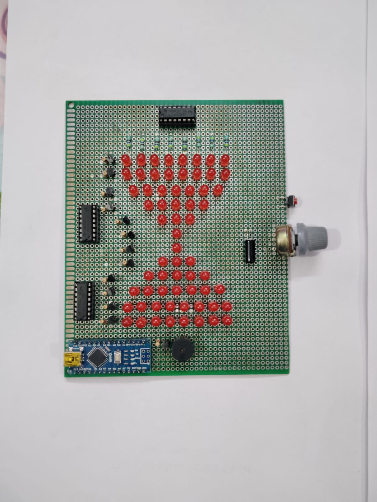

# LED Matrix Hourglass

An animated digital hourglass implemented on a 12×8 custom LED matrix using multiplexed display driving.

## Features
- Multiplexed LED matrix display using shift registers
- Particle-based sand simulation
- Adjustable timer using potentiometer
- Orientation detection using a tilt switch
- Automatic hourglass flip when device is rotated

## Hardware
- Arduino Nano
- 74HC595 shift registers
- NPN transistor row drivers
- 64 LEDs
- Tilt switch sensor
- Potentiometer and push button
- TP4056 Charging Module
- MT3608 DC-DC Boost Module
- 18650 Battery

## Software
Developed using PlatformIO in Visual Studio Code.
Firmware written in C++ using the Arduino framework.

## Working
The LED Hourglass is an interactive, battery-powered project, built from scratch to
simulate a physical hourglass. Instead of just buying an square LED matrix module,
soldered 64 individual red LEDs onto a perfboard in a custom geometric
shape. The project has an Arduino Nano, which runs a real-time particle physics animation
to make the ”sand” fall smoothly, using a display technique (multiplexing) so it didn’t
run out of microcontroller pins.

Figuring out how to control 64 LEDs with only three Arduino data pins was biggest
challenge that was solved by cascading three 74HC595 shift registers together. But the
shift registers couldn’t handle the power draw of an entire row of LEDs turning on at
once, so wired BC548 NPN transistors (low side switch) to handle the heavy lifting
and sink the current safely to ground. Also calculated and soldered 470Ω resistors for
every column to keep the LEDs at a safe 6.4 mA so nothing would overheat. To make
the whole thing portable, it runs on a single 18650 battery, using a TP4056 to charge it
and an MT3608 boost converter to feed a clean 5V directly to the chips.

On the software side, instead of using delay() function, the code uses a non-blocking
millis() timer. This forces the Arduino to multitask perfectly it redraws the LED matrix
fast enough to trick the human eye (Persistence of Vision), calculates where the sand
particles should land, checks the sensors, and runs the alarm buzzer, all at the exact
same time without lagging.

There is a potentiometer knob that lets the user select a timer duration anywhere from
30 seconds to 60 minutes. To feel like a real physical object, added a hardware sensor SW-520D tilt switch. When you physically pick up the hourglass and flip it upside down,
the switch detects it. A 250ms ”debounce” filter was used in the code so it ignores the
mechanical noise of the switch, and instantly reverses the gravity of the digital sand on
the screen.

Beyond theoretical design, the project required the practical execution of a hand-soldered physical circuit. This implementation provided critical hands-on experience in hardware expansion using shift registers, power load management via transistors, software-based sensor debouncing, and autonomous battery integration.